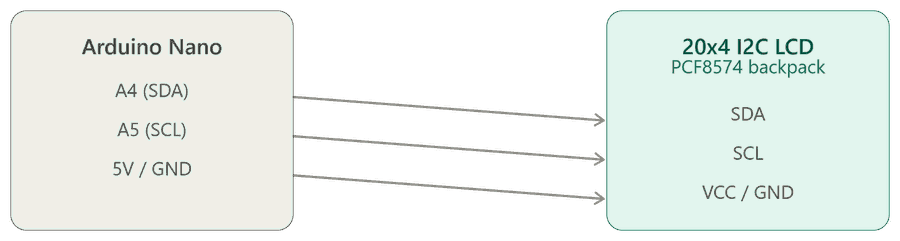
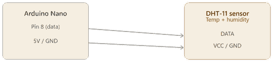
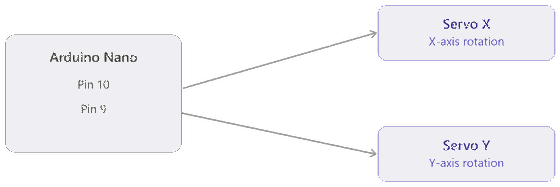

# Solar Panel Tracker

Dual-axis solar tracking system built on an Arduino Nano — developed as an electrical engineering co-op portfolio project (University of Waterloo).

The panel actively follows the sun across two axes using four photoresistors, while an onboard display shows live environmental and power data. It's a hands-on hardware + embedded software project combining sensor input, closed-loop actuation, and real-time monitoring.

## Table of Contents
- [Functional Components](#functional-components)
- [Pin Reference](#pin-reference)
- [Support / Non-functional components](#support--non-functional-components)
- [Setup & Usage](#setup--usage)
- [Conclusion](#conclusion)
- [Lab Results](#lab-results)
- [Media Gallery](#media-gallery)

## Functional Components

### 1. 20x4 I2C LCD (PCF8574 backpack)

**PCF8574 backpack**
Purpose: To reduce the number of pins used on the Arduino Nano.

**LCD display (20x4)**
Purpose: To live-display environmental/electrical data: Humidity (%), Temperature (C), Voltage (V), Current (A), Power (W), Energy (Wh).

Display layout:
```
H(%):##.##T(C):##.##
V(V):##.##(A):##.##
P(W):##.##
E(Wh):##.##
```



### 2. Photoresistors (North, West, South, East)

Purpose: To compare voltages across the four NWSE sensors and use `analogRead()` to drive `anglex` and `angley` for both servo motors.


### 3. DHT-11 Sensor

Purpose: To read temperature (°C) and humidity (%) with microcoltroller (arduino nano) and display it live on the LCD.



### 4. Servo Motors x2 (ServoX & ServoY)

**ServoX** — Drives panel rotation across the X-axis (20–160°).
**ServoY** — Drives panel rotation across the Y-axis (20–160°).



### 5. Solar Panel (100x100mm) + ACS712

Purpose:
**Solar Panel** — Converts sunlight into electricity via the photoelectric effect, lighting the red LED indicator and providing raw data for the Nano to read and display.

**ACS712** — Measures the current (A) the panel produces, so the program can calculate real power output (V × I) and confirm the tracker is improving energy capture.

[Solar panel + ACS712 wiring diagram](./assets/solar_panel_wiring_diagram.md)

## Pin Reference

| Component | Arduino Nano Pin | Notes |
|---|---|---|
| LCD — SDA | A4 | I2C bus |
| LCD — SCL | A5 | I2C bus |
| Photoresistor — North (`ps1`) | A3 | |
| Photoresistor — West (`ps2`) | A2 | |
| Photoresistor — South (`ps3`) | A1 | |
| Photoresistor — East (`ps4`) | A0 | |
| DHT-11 data (`sensePin`) | D8 | |
| ServoY (`ypin`) | D9 | Y-axis |
| ServoX (`xpin`) | D10 | X-axis |
| Toggle switch (`switchpin`) | D3 | `INPUT_PULLUP` |
| LED indicator (`ledpin`) | D2 | |
| Panel voltage sense (`voltagePin`) | A6 | Raw panel voltage |
| Panel current sense (`currentPin`) | A7 | ACS712 output |

## Support / Non-functional components

| Component | Purpose |
|---|---|
| Push Button | Toggles the LCD display on/off (and backlight), acting as the manual switch for showing/hiding live sensor data without power-cycling the board. |
| Green LED | Indicates on/off status for the LCD display. |
| Red LED | Indicates the solar panel is actively generating current (lights up proportional to current flow detected by the ACS712). |
| External Power Provider + 9V Battery | Supplies power to the Nano and servos independently of USB, allowing the tracker to run untethered/portable. |
| Breadboard (x2) | Solderless platform for prototyping the sensor, LED, and divider circuits before finalizing connections. |
| Jumper Wires | Carry connections between the Arduino, sensors, LCD, servos, and breadboard. |
| Jenga Blocks (2x) | Structural support for mounting the servo motors at the correct height/angle. |
| Main Base | Mounting platform holding all components together as a stable unit. |

## Setup & Usage

**Required libraries** (install via Arduino IDE Library Manager):
- `Servo.h` (built-in)
- `LiquidCrystal_I2C.h` (Frank de Brabander, v1.1.2)
- `DHT.h` (Adafruit)
- `math.h` (built-in)

**Board**: Arduino Nano (select "ATmega328P" for recent Arduino Nano)

**Steps:**
1. Wire components according to the diagrams above.
2. Open `solar_tracker_main/solar_tracker_main.ino` in the Arduino IDE.
3. Select the correct board and COM port (the one labeled "(USB)" if multiple ports appear).
4. Upload.
5. Use the toggle switch to turn the LCD display on/off.

## Conclusion

This project demonstrates a fully functional dual-axis solar tracking system built on an Arduino Nano, combining sensor-driven actuation, real-time environmental monitoring, and live power measurement into a single embedded system. Throughout, I've learned further about hardware and software, the importance of soldering, and the danger of touching unsoldered components after executing the code. This lesson came from personal experience — while trying to reduce the number of pins needed for the LCD display, I found the I2C PCF8574 backpack, which lets the LCD run on just two data pins instead of 12 (including the potentiometer). The backpack I ordered arrived unsoldered (with holes), and while testing it — expecting it would still work before soldering — I touched the exposed I2C PCF8574 backpack the moment I uploaded code — it was extremely hot, and I got an electric shock from it. Even at an expected safe 5V, exposed unsoldered joints can carry enough current to genuinely burn, and that experience pushed me to actually learn the importance of soldering rather than treating it as optional. Moving on, I quickly learned how to precisely solder and quickly applied the skills to successfully combine the LCD monitor and the I2C PCF8574 backpack. The tracker reliably follows sunlight across two axes while displaying live humidity, temperature, voltage, current, and power data. In testing, active dual-axis tracking improved energy capture by [28.04%](./docs/Solar_Tracker_Lab_Results.pdf) compared to a fixed-panel baseline. Looking ahead, the next major improvement would be to retain all the sensor and power data being collected rather than only displaying it live, and to use and analyze that accumulated data — solar output trends, humidity, and temperature — to create a live model that can predict incoming rain and automatically shut down or park the tracker, protecting the servos and panel from weather exposure before damage can occur — all while still capturing solar energy as efficiently as possible. Overall, the project reflects hands-on experience in embedded C++, sensor calibration, closed-loop control, and hardware & software debugging, and serves as a practical demonstration of applied electrical engineering skills.

## Lab Results

Full test data and methodology behind the 28.04% efficiency improvement figure are documented in the [lab results report](./docs/Solar_Tracker_Lab_Results.pdf).

## Media Gallery

Photos and video of the components, the tracker in action, and testing footage are linked in [`assets/media_gallery.md`](./assets/media_gallery.md).
